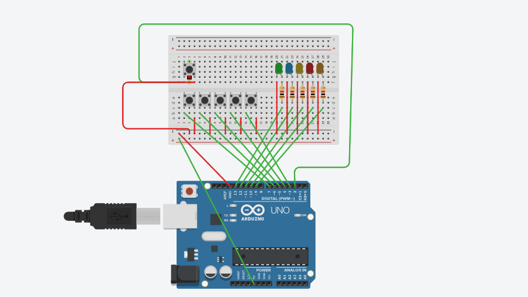

# Jogo de Reflexo

Este projeto é um jogo de reflexo e precisão desenvolvido em uma caixa com botões iluminados, projetado para testar a velocidade e a coordenação do usuário. O jogo possui um painel com múltiplos botões LED dispostos em posições estratégicas. Cada botão possui um LED que acende aleatoriamente, e o objetivo do jogador é apertar o botão correto o mais rápido possível quando ele acender.

### `Status`

Finalizado

### `O que foi Usado?`

- Linguagem C

### `Montagem`

   

     
   

### `Apresentação`

   

     
   

<!--  
- [www.themoviedb.org](www.themoviedb.org)
 
- [www.themoviedb.org](http://warezcdn.com/) -->

